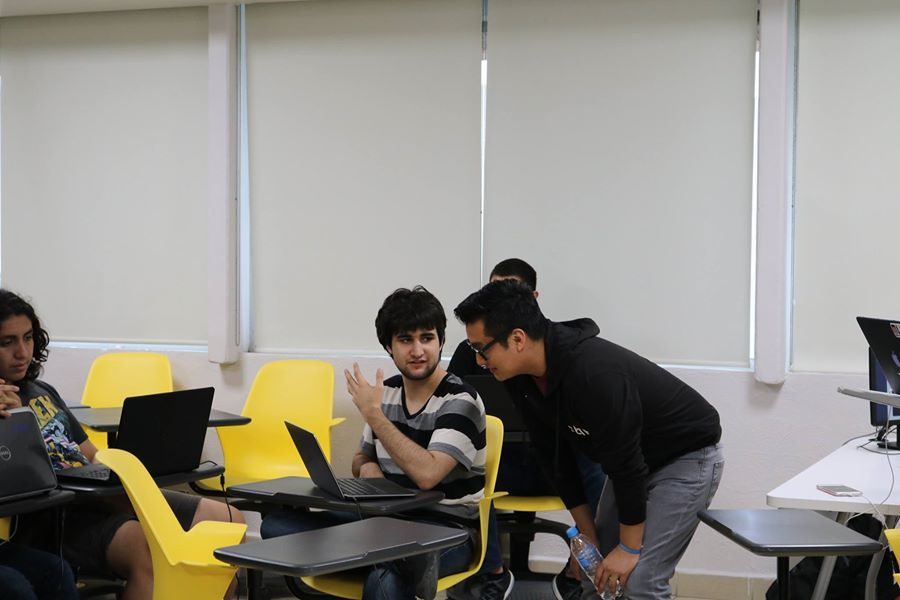

I'm a software engineer specializing in modern JavaScript. I make things from scratch, contribute to open source, and create resources that are accessible and intuitive to new developers.

Outside of work you can find me hiking with my dog, Marvel.

## Writing

- [Main Blog](/tutorials)

## Speaking

- [PDX Nodeschool](https://github.com/evanlucas/learnyoumongo) - Workshop: MongoDB 101
- [ProductHunt](https://twitter.com/emiliorami/status/708450488522448896) - Implementing Accessibility 101
- [EpicQueen](https://twitter.com/SULMAGUTIERREZ/status/729113496881750016) - How Webpack Works
- [EpicQueen](https://twitter.com/EpicQueen/status/702686804009312256) - Code Reviews: CSS edition
- [Open Hack Nights](https://secure.meetupstatic.com/photos/event/1/3/c/2/highres_441425058.jpeg) - Implement Fuzzy Search in a Few Lines of Ruby

## Open Source

- [laurosilvacom](https://github.com/laurosilvacom/laurosilvacom) - My personal theme for Gatsby (the source of this website)
- [Svelte Cheatsheet](https://github.com/laurosilvacom/svelte-cheatsheet) - Cheatsheet for developers getting started with Svelte
- [React+TypeScript Cheatsheets ES](https://github.com/typescript-cheatsheets/react-typescript-cheatsheet-es) - Spanish translation of react-typescript-cheatsheet

## More

- [Uses Page](http://localhost:8000/uses) - Links to all the tools I use
