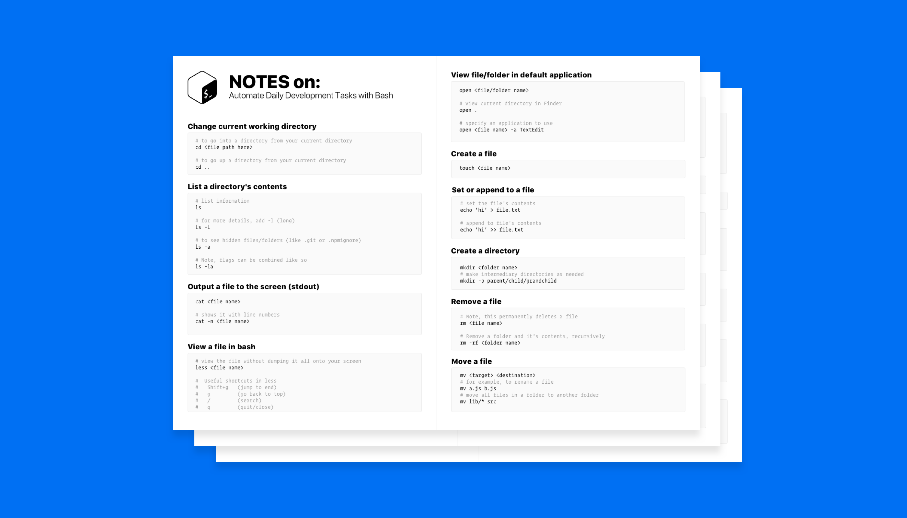

After finishing [Cameron's](https://twitter.com/ccnokes) course [Automate Daily Development Tasks with Bash](https://egghead.io/courses/automate-daily-development-tasks-with-bash). I decided to create a well designed cheatsheet.

Feel free to download a copy!

[💾 Download PDF](/bash.pdf)

